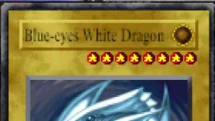

<!-- back to top anchor -->
<a id="readme-top"></a>

<!-- PROJECT SHIELDS -->
[![Contributors][contributors-shield]][contributors-url]
[![Forks][forks-shield]][forks-url]
[![Stargazers][stars-shield]][stars-url]
[![Issues][issues-shield]][issues-url]

<!-- PROJECT LOGO -->
<br />
<div align="center">
  <a href="https://github.com/rodrigoazlima/ygofm-app">
    
  </a>

  <h3 align="center">Yu-Gi-Oh! Forbidden Memories Search</h3>

  <p align="center">
    Card reference tool for Yu-Gi-Oh! Forbidden Memories (PS1). Search cards, inspect stats, explore fusions, and check drop tables.
    <br />
    <br />
    <a href="https://rodrigoazlima.github.io/ygofm-app/">View Live</a>
    &middot;
    <a href="https://github.com/rodrigoazlima/ygofm-app/issues/new?labels=bug">Report Bug</a>
    &middot;
    <a href="https://github.com/rodrigoazlima/ygofm-app/issues/new?labels=enhancement">Request Feature</a>
  </p>
</div>

<!-- TABLE OF CONTENTS -->
<details>
  <summary>Table of Contents</summary>
  <ol>
    <li><a href="#about-the-project">About The Project</a>
      <ul>
        <li><a href="#built-with">Built With</a></li>
      </ul>
    </li>
    <li><a href="#features">Features</a></li>
    <li><a href="#getting-started">Getting Started</a>
      <ul>
        <li><a href="#prerequisites">Prerequisites</a></li>
        <li><a href="#installation">Installation</a></li>
      </ul>
    </li>
    <li><a href="#data">Data</a></li>
    <li><a href="#roadmap">Roadmap</a></li>
    <li><a href="#contact">Contact</a></li>
  </ol>
</details>

---

<!-- ABOUT THE PROJECT -->
## About The Project

A fast, dark-themed reference tool for the PS1 classic **Yu-Gi-Oh! Forbidden Memories**. Look up any of the 722 cards, trace fusion paths, find which duelists drop a card, and check equip compatibility — all in one place.

<p align="right">(<a href="#readme-top">back to top</a>)</p>

### Built With

[![Next.js][Next-badge]][Next-url]
[![React][React-badge]][React-url]
[![TypeScript][TS-badge]][TS-url]
[![Tailwind][Tailwind-badge]][Tailwind-url]

<p align="right">(<a href="#readme-top">back to top</a>)</p>

---

<!-- FEATURES -->
## Features

- **Card grid** — all 722 FMR cards as thumbnails on a dark background
- **Live search** — filter by name; double-click to clear
- **Card detail**
  - Card image, type, attribute
  - ATK / DEF, level, guardian stars
  - Description, ID, Stars value, password
- **Fusion relations**
  - *Fuses Into* — what this card produces when fused
  - *Combines With* — partners and results for this card
  - *Compatible Spells* — equip cards that boost this monster
  - *Made From* — ingredients that produce this card
- **Drop table** — which NPCs drop each card and at what rate
- **NPC view** — click any duelist to see their full drop list
- **Type / Attribute views** — filter the grid by monster type or attribute
- **Full image coverage** — all 722 cards have images (local WebP → CDN fallback)

<p align="right">(<a href="#readme-top">back to top</a>)</p>

---

<!-- GETTING STARTED -->
## Getting Started

### Prerequisites

- Node.js 24+
- npm

### Installation

1. Clone the repo
   ```sh
   git clone https://github.com/rodrigoazlima/ygofm-app.git
   cd ygofm-app
   ```
2. Install dependencies
   ```sh
   npm install
   ```
3. Start the dev server
   ```sh
   npm run dev
   ```
4. Open [http://localhost:3000](http://localhost:3000)

<p align="right">(<a href="#readme-top">back to top</a>)</p>

---

<!-- DATA -->
## Data

| File | Contents |
|---|---|
| `src/data/cards.json` | All 722 card definitions (stats, type, attribute, code) |
| `src/data/fusions.json` | Fusion recipe table |
| `src/data/results.json` | Reverse fusion lookup |
| `src/data/drops.json` | NPC drop tables |
| `src/data/localImages.json` | Map of card ID → local image path |
| `public/images/` | Local card art (`.webp` / `.png` / `.jpg`) |

Scripts in `scripts/` can be used to find and download missing card images from CDN and Yugipedia.

<p align="right">(<a href="#readme-top">back to top</a>)</p>

---

<!-- ROADMAP -->
## Roadmap

- [ ] Deck builder
- [ ] Duelist drop rate comparison
- [ ] Mobile-optimized layout

See the [open issues](https://github.com/rodrigoazlima/ygofm-app/issues) for a full list of proposed features and known issues.

<p align="right">(<a href="#readme-top">back to top</a>)</p>

---

<!-- CONTACT -->
## Contact

Project Link: [https://github.com/rodrigoazlima/ygofm-app](https://github.com/rodrigoazlima/ygofm-app)

<p align="right">(<a href="#readme-top">back to top</a>)</p>

---

<!-- MARKDOWN LINKS & BADGES -->
[contributors-shield]: https://img.shields.io/github/contributors/rodrigoazlima/ygofm-app.svg?style=for-the-badge
[contributors-url]: https://github.com/rodrigoazlima/ygofm-app/graphs/contributors
[forks-shield]: https://img.shields.io/github/forks/rodrigoazlima/ygofm-app.svg?style=for-the-badge
[forks-url]: https://github.com/rodrigoazlima/ygofm-app/network/members
[stars-shield]: https://img.shields.io/github/stars/rodrigoazlima/ygofm-app.svg?style=for-the-badge
[stars-url]: https://github.com/rodrigoazlima/ygofm-app/stargazers
[issues-shield]: https://img.shields.io/github/issues/rodrigoazlima/ygofm-app.svg?style=for-the-badge
[issues-url]: https://github.com/rodrigoazlima/ygofm-app/issues

[Next-badge]: https://img.shields.io/badge/Next.js-000000?style=for-the-badge&logo=nextdotjs&logoColor=white
[Next-url]: https://nextjs.org/
[React-badge]: https://img.shields.io/badge/React-20232A?style=for-the-badge&logo=react&logoColor=61DAFB
[React-url]: https://reactjs.org/
[TS-badge]: https://img.shields.io/badge/TypeScript-3178C6?style=for-the-badge&logo=typescript&logoColor=white
[TS-url]: https://www.typescriptlang.org/
[Tailwind-badge]: https://img.shields.io/badge/Tailwind_CSS-38B2AC?style=for-the-badge&logo=tailwind-css&logoColor=white
[Tailwind-url]: https://tailwindcss.com/
